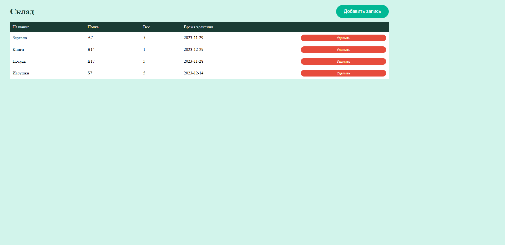
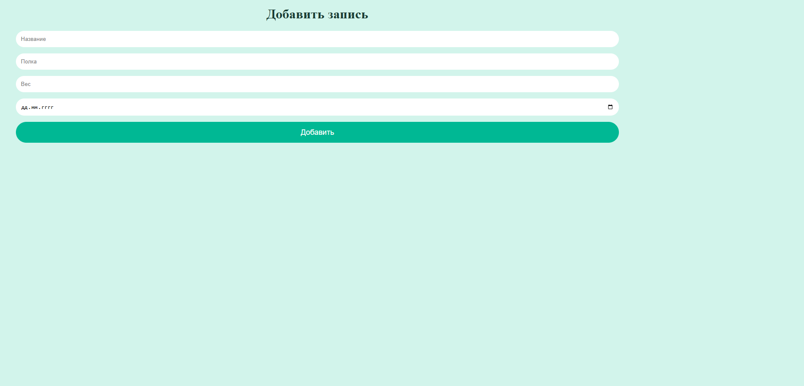

# Warehouse management system 🏭

A modular web application for managing warehouse inventory with two dynamic pages, local storage, and intelligent sorting.

## 🚀 Live Demo  
**[View the live website here](https://kseniiasad.github.io/Warehouse-management-system/)**

## 📸 Preview

| Warehouse Page (Inventory) | Add Record Page (Form) |
|----------------------------|------------------------|
|  |  |

## ✨ Features

- **Two Dynamic Pages**: "Warehouse" (inventory list) and "Add Record" (input form)
- **Smart Sorting**: Click column headers to sort by name, shelf, weight, or storage date
- **Delete Operations**: Remove individual items from inventory
- **Local Storage**: Data persists in browser between sessions
- **Page Transitions**: Navigation with 500ms loading indicators
- **Initial Loader**: 5-second loading animation on first launch
- **Form Validation**: Client-side validation for all input fields
- **Modular Architecture**: Clean ES6 module structure with dynamic imports

## 🛠 Technologies Used

- **JavaScript (ES6+)**: Core application logic
- **ES6 Modules**: Modular architecture with dynamic imports (`import/export`)
- **LocalStorage**: Client-side data persistence
- **HTML5 & CSS3**: Structure and styling
- **Async/Await**: Asynchronous page loading

## 📁 Project Structure
warehouse-inventory-app/
├── index.html
├── styles.css
├── js/
│ └── index.js
│ └── addPage.js
│ └── components.js
│ └── navigate.js
│ └── storage.js
│ └── warehousePage.js
├── README.md
├── preview.png
├── preview-add.png

## 📬 Contact  
[My GitHub Profile](https://github.com/KseniiaSad)
